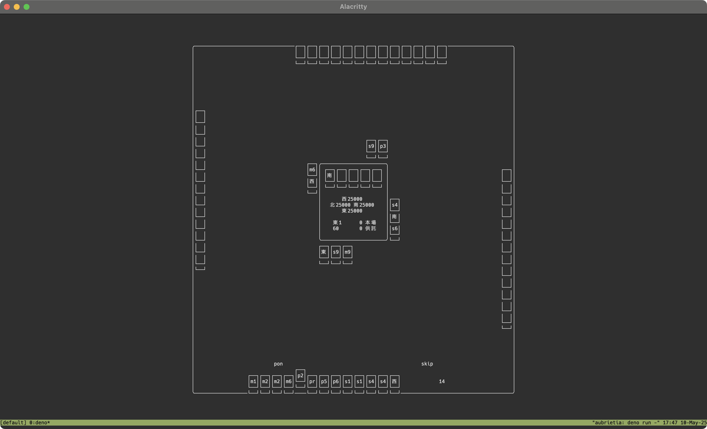

# Mahjong TUI

Mhjong TUI は Terminal 上で動作する麻雀ゲームです。具体的な UI は以下の画像を参考にして下さい。麻雀のルールは、半荘四麻赤アリアリ。その他、細かなルールは天鳳を参考にしています。麻雀牌それぞれの表記は省略表記を用いており、萬子: `m`、筒子: `p`、索子: `s` に続ける形で `1-9` で数牌を表現しています。字牌はそれぞれ漢字一文字で表現しています。また、赤ドラは `1-9` の数値の箇所を `r` へと変更して表現しています。



ゲームを起動すると、マッチングは自動で行われます。最大 20秒間の待ち時間の後に、ゲームが開始します。参加人数が 4人に満たなかった場合には、CPU が不足人数分代理で入ります。ゲームを Ctrl-C などで途中退出した場合には、以降のプレイは CPU が代理で行います。

## Run

### Server

Mahjong TUI の Server は以下の通りに実行します。Server はデフォルトで `http://localhost:8080` にて起動します。

```bash
deno run -A server/main.ts
```

### Client

Mahjong TUI の Client は以下の通りに実行します。Client はデフォルトで `http://localhost:8080` へと接続します。

```bash
deno run -A server/main.ts
```

## Test

Mahjong TUI の Test は以下の通りに実行します。天鳳の牌譜を元に、ゲームロジックが妥当なものかなどを検証しています。

```bash
deno test -A
```

## Build

```bash
docker buildx build --platform linux/amd64,linux/arm64 -t ghcr.io/k-jun/mahjong-tui:latest --push .
```
